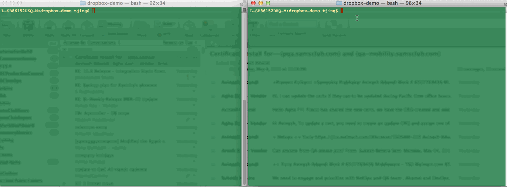

Dropbox 

This is a basic Dropbox clone to sync files across multiple remote folders.

Time spent: 15 hours

 Features

 Required

- [x] Client can make GET requests to get file or directory contents
- [x] Client can make HEAD request to get just the GET headers 
- [x] Client can make PUT requests to create new directories and files with content
- [x] Client can make POST requests to update the contents of a file
- [x] Client can make DELETE requests to delete files and folders
- [x] Server will serve from `--dir` or cwd as root
- [x] Client will sync from server over TCP to cwd or CLI `dir` argument

 Walkthrough

